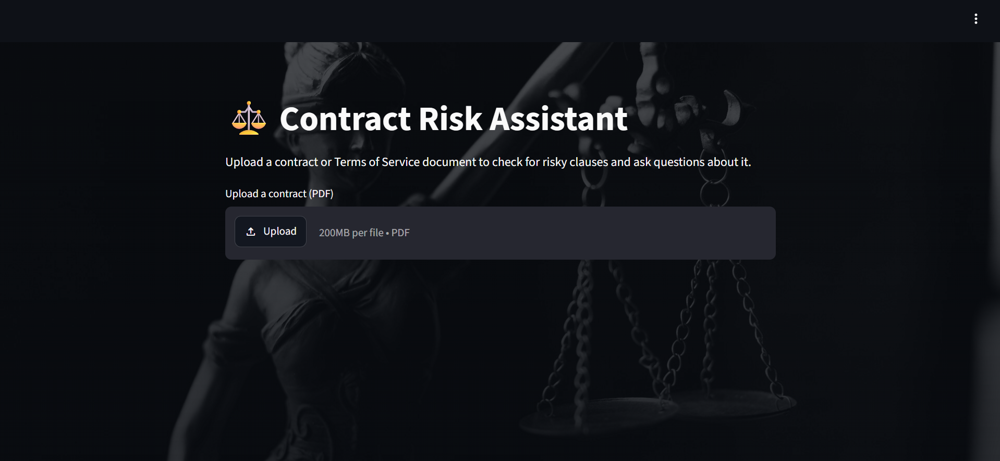
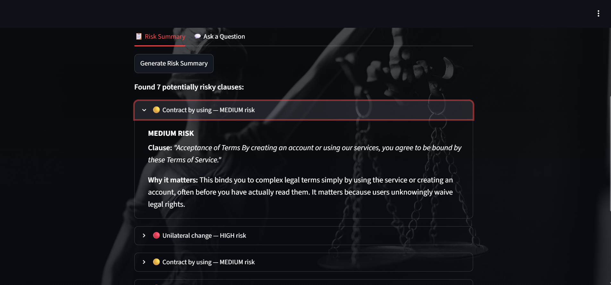
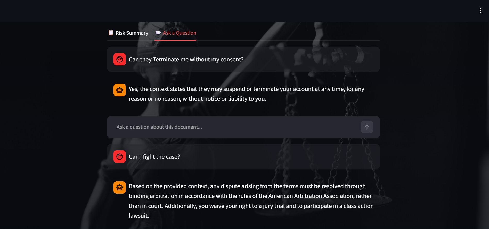

# ⚖️ Contract Risk Assistant

An AI system that reads Terms of Service documents and contracts, flags clauses that are potentially unfair to the person signing, explains them in plain English, and answers open-ended questions about the document — grounded in the document's actual text.

**🔗 Live demo:** `https://contract-risk-assistant-40152500375.us-central1.run.app`

---

## The problem

Most people accept Terms of Service agreements without reading them — the language is dense, the documents are long, and there's no easy way to know which clauses actually matter. This project builds a system that does that reading for you: it identifies specific categories of unfair clauses (unilateral termination, arbitration requirements, liability limitations, and more), explains what they mean in practice, and lets you ask follow-up questions about the specific document you uploaded — not generic legal advice, but answers grounded in what the document actually says.

## Demo




---

## What this project demonstrates

This isn't a single model wrapped in a demo — it's a full pipeline, built and evaluated in stages, with each stage's results honestly reported:

| Stage | What was built | Result |
|---|---|---|
| Classical baseline | TF-IDF + Logistic Regression, multi-label, class-weighted | 0.63 macro-F1 |
| Fine-tuned transformer | DistilBERT, fine-tuned on the same task | **0.76 macro-F1** |
| Published benchmark comparison | LexGLUE (ACL 2021) reported baselines | TF-IDF+SVM: 0.75 · BERT: 0.81 · Legal-BERT: 0.83 |
| Interpretability | Leave-one-out word-importance analysis | Confirmed the model uses semantic understanding, not keyword matching (see below) |
| Retrieval-augmented generation | Chunking + embeddings + ChromaDB + Gemini | Grounded Q&A over any uploaded document, with a verified hallucination guardrail |
| Deployment | Docker, FastAPI, Streamlit, Google Cloud Run | Live, public, containerized application |

**A key finding from building the classical baseline**: while investigating why the TF-IDF vectorizer's vocabulary seemed to be missing relevant terms, a check for the literal word "unilateral" (in any form) across the entire training set returned zero matches — despite two of the eight categories being named "Unilateral termination" and "Unilateral change." Real clauses granting one-sided power read like *"we may terminate your account at any time, for any reason"* — the concept is legal and semantic, never the literal keyword. This confirmed the task requires genuine language understanding rather than keyword detection, and directly motivated moving from a bag-of-words model to a transformer capable of capturing that meaning.

---

## Architecture

```
┌─────────────────┐        ┌──────────────────┐         ┌───────────────────┐
│   Streamlit UI  │ ─────▶│   FastAPI backend | ─────▶ │  Fine-tuned       │
│  (upload, chat, │        │  /classify       │         │  DistilBERT       │
│   risk cards)   │ ◀─────│  /upload          │ ◀───── │  (hosted on       │
└─────────────────┘        │  /ask            │         │  Hugging Face Hub)│
                           │  /risk-summary   │         └───────────────────┘
                           └──────────────────┘
                                   │
                    ┌──────────────┼────────────────┐
                    ▼              ▼                ▼
             ┌───────────┐  ┌─────────────┐  ┌─────────────┐
             │ ChromaDB  │  │ Sentence-   │  │  Gemini     │
             │ (vector   │  │ Transformers│  │  API        │
             │  store)   │  │ (embeddings)│  │ (generation)│
             └───────────┘  └─────────────┘  └─────────────┘
```

Both services run in a single Docker container in production (required by the deployment target), with FastAPI started in the background and Streamlit as the foreground process. A separate `docker-compose.yml` runs them as two containers for local development.

---

## Dataset

**[UNFAIR-ToS](https://huggingface.co/datasets/coastalcph/lex_glue)**, part of the **LexGLUE** benchmark (Chalkidis et al., ACL 2021) — ~5,500 real sentences from Terms of Service documents across ~50 online services, multi-label annotated across 8 unfairness categories:

`Limitation of liability` · `Unilateral termination` · `Unilateral change` · `Content removal` · `Contract by using` · `Choice of law` · `Jurisdiction` · `Arbitration`

The dataset is significantly imbalanced (88.6% of sentences carry no label), which directly shaped the modeling and evaluation choices below.

---

## Tech stack

- **Modeling**: scikit-learn (TF-IDF + Logistic Regression baseline), Hugging Face `transformers` (DistilBERT fine-tuning), PyTorch
- **Interpretability**: custom leave-one-out word-importance analysis
- **RAG**: `sentence-transformers` (`all-MiniLM-L6-v2`) for embeddings, ChromaDB for vector storage, Google Gemini API for grounded generation
- **Backend**: FastAPI
- **Frontend**: Streamlit
- **Deployment**: Docker, Google Cloud Run
- **Model hosting**: Hugging Face Hub

---

## Honest limitations

Documenting these deliberately, rather than glossing over them:

- **Vector storage is ephemeral in this deployment.** ChromaDB writes to the container's local disk, which does not persist across container restarts or scale events. A production version would use a managed vector database (e.g. Chroma Cloud, Pinecone, or pgvector) so uploaded documents persist independent of the container lifecycle.
- **CPU-only, no GPU.** The classifier (DistilBERT) and embedding model (MiniLM) were both chosen partly for being lightweight enough to fine-tune and run on CPU. A GPU-trained Legal-BERT would likely close some of the remaining gap to the published benchmark's best score.
- **The LLM (Gemini) uses a cost-efficient "flash-lite" tier**, chosen deliberately since the retrieval step does most of the heavy lifting — grounding answers in retrieved text reduces how much is asked of the generation model itself.
- **Sentence splitting for classification is a simple regex-based approach**, not a full NLP sentence tokenizer — it can misparse abbreviations or unusual punctuation in some documents.

---

## Running it locally

### Prerequisites
- Docker and Docker Compose
- A free [Google AI Studio](https://aistudio.google.com) API key (for Gemini)

### Setup

```bash
git clone https://github.com/akshatsharma-02/contract-risk-assistant.git
cd contract-risk-assistant
```

Create a `.env` file in the project root:
```
GEMINI_API_KEY=your-key-here
```

Run both services:
```bash
docker compose up --build
```

Open `http://localhost:8501`.

> **Note on the model**: the fine-tuned classifier is hosted on the Hugging Face Hub (`akshat-02/contract-risk-classifier`) and downloaded automatically during the Docker build — no manual model file setup required.

---

## Project structure

```
contract-risk-assistant/
├── api/                  # FastAPI backend
├── streamlit/            # Streamlit frontend
├── notebooks/            # EDA, model training, evaluation, RAG development
├── models/                # Saved classical baseline model + evaluation metrics
├── data/                  # Sample document(s)
├── Dockerfile              # Single-container build (Cloud Run deployment)
├── docker-compose.yml       # Two-container build (local development)
└── start.sh                 # Startup script for the combined deployment container
```

---

## Possible future improvements

- Swap ChromaDB's local storage for a managed vector database to remove the ephemeral-storage limitation
- Add Legal-BERT as an alternative classifier and compare against DistilBERT
- Support multi-document comparison (ask questions across several uploaded contracts at once)
- Add user-facing confidence scores alongside risk classifications

---

## Acknowledgments

- **UNFAIR-ToS / LexGLUE**: Chalkidis et al., *"LexGLUE: A Benchmark Dataset for Legal Language Understanding in English"* (ACL 2021); original dataset from Lippi et al., *"CLAUDETTE: an automated detector of potentially unfair clauses in online terms of service."*
- **DistilBERT**: Sanh et al., Hugging Face
- **sentence-transformers**: Reimers & Gurevych
